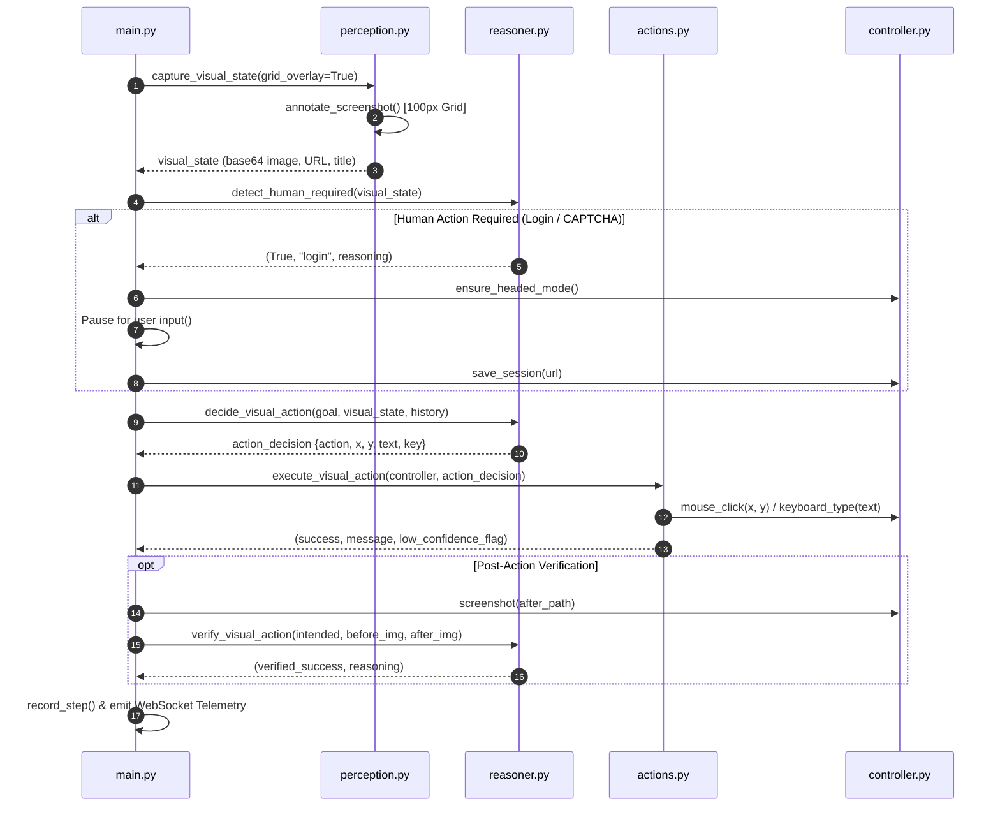

# Pure Visual Computer-Use Browser Agent: Architectural & System Report

## 1. Executive Overview

The **Pure Visual Computer-Use Browser Agent** is a state-of-the-art autonomous web automation system built on Playwright and Multimodal Vision Language Models (`qwen/qwen3.6-27b` via Groq API).

Unlike legacy web agents that rely on fragile DOM selectors, CSS locators, or XPath strings, this agent operates **purely from visual screenshot analysis**. It interacts with web applications just like a human: observing a 1280x800 pixel viewport, determining exact $(X, Y)$ coordinate targets, executing physical hardware actions (mouse movements, clicks, keystrokes, scrolling, downloads), and verifying page state changes visually.

### Key Capabilities & Breakthrough Innovations
- **Zero DOM-Selector Reliance**: Operates completely without inspecting HTML source code, DOM trees, or CSS classes.
- **100px Grounding Reference Grid**: Overlays light semi-transparent coordinate gridlines and numeric labels on screenshots to ground spatial predictions.
- **Human Handoff Flow**: Automatically detects login forms, CAPTCHA puzzles, 2FA prompts, and payment screens, switching to headed browser mode and pausing for human interaction.
- **Session Persistence**: Auto-saves and reloads browser storage states (`sessions/<domain>.json`) across runs.
- **Post-Action Visual Verification**: Compares before vs. after screenshots to confirm if actions succeeded before proceeding.
- **2x Zoom-Retry Recovery**: Automatically crops, upscales 2x, and re-evaluates 400x400 regions when visual loops or spatial uncertainties occur.
- **Real-Time Telemetry & Dashboard**: Streams execution frames, crosshairs, and reasoning over WebSockets to a Web Dashboard SPA and Chrome Extension Manifest V3 Side Panel.

---

## 2. System Architecture & Component Breakdown

```
                  ┌─────────────────────────────────────────┐
                  │       CLI / REST API / Extension        │
                  └────────────────────┬────────────────────┘
                                       │ (Goal, URL, Mode)
                                       ▼
┌─────────────────────────────────────────────────────────────────────────────┐
│                             AGENT CONTROL LOOP                              │
│                                 (main.py)                                   │
└──────┬──────────────────┬────────────────────┬───────────────────┬──────────┘
       │                  │                    │                   │
       ▼                  ▼                    ▼                   ▼
┌──────────────┐   ┌──────────────┐    ┌──────────────┐    ┌──────────────┐
│  Perception  │   │   Reasoner   │    │  Controller  │    │Context Vault │
│(perception.py│   │ (reasoner.py)│    │(controller.py│    │(vault.py)    │
└──────┬───────┘   └──────┬───────┘    └──────┬───────┘    └──────────────┘
       │                  │                    │
       ▼                  ▼                    ▼
[100px Grid Overlay] [qwen3.6-27b Vision] [1280x800 Playwright]
       │                  │                    │
       └──────────────────┴────────────────────┘
                          │
                          ▼
            ┌───────────────────────────┐
            │  Action Execution Engine  │
            │       (actions.py)        │
            └─────────────┬─────────────┘
                          │
                          ▼
            ┌───────────────────────────┐
            │   Telemetry WebSocket     │
            │        (server.py)        │
            └───────────────────────────┘
```

### Component Directory & Responsibilities

| File Path | Primary Function & Responsibilities |
| :--- | :--- |
| **[`main.py`](file:///c:/Users/zain/OneDrive/Desktop/Al%20Agent%20Browser%20Extension/browser-agent/main.py)** | Central control loop orchestrating perception, reasoning, action execution, human handoff, zoom retry, telemetry, and goal self-assessment. |
| **[`browser/controller.py`](file:///c:/Users/zain/OneDrive/Desktop/Al%20Agent%20Browser%20Extension/browser-agent/browser/controller.py)** | Manages Playwright browser context locked to `1280x800`. Handles smooth mouse movements, hardware inputs, domain session saving/loading, and headed mode switching. |
| **[`browser/perception.py`](file:///c:/Users/zain/OneDrive/Desktop/Al%20Agent%20Browser%20Extension/browser-agent/browser/perception.py)** | Captures 1280x800 visual state and applies `annotate_screenshot()` to render the 100px red grounding reference grid on PNG screenshots. |
| **[`agent/reasoner.py`](file:///c:/Users/zain/OneDrive/Desktop/Al%20Agent%20Browser%20Extension/browser-agent/agent/reasoner.py)** | Multimodal reasoning engine. Implements `decide_visual_action()`, `detect_human_required()`, `decide_visual_action_zoomed()`, `verify_visual_action()`, and `assess_goal_completion()`. |
| **[`browser/actions.py`](file:///c:/Users/zain/OneDrive/Desktop/Al%20Agent%20Browser%20Extension/browser-agent/browser/actions.py)** | Action execution engine translating decisions into Playwright hardware actions: `click`, `type`, `select`, `key`, `scroll`, `download`, `ask_human`, `done`. |
| **[`agent/memory.py`](file:///c:/Users/zain/OneDrive/Desktop/Al%20Agent%20Browser%20Extension/browser-agent/agent/memory.py)** | Tracks execution steps, flags low-confidence predictions, detects spatial repetition loops (3x clicks within 10px radius), and manages zoom retry attempts. |
| **[`agent/context_vault.py`](file:///c:/Users/zain/OneDrive/Desktop/Al%20Agent%20Browser%20Extension/browser-agent/agent/context_vault.py)** | User profile memory vault (`config/user_profile.json`). Fuzzy maps field queries (e.g., "Student ID" $\rightarrow$ `roll_number`) to fill forms automatically. |
| **[`server.py`](file:///c:/Users/zain/OneDrive/Desktop/Al%20Agent%20Browser%20Extension/browser-agent/server.py)** | FastAPI REST API and WebSocket telemetry server (`/ws/telemetry`) streaming step events, screenshots, and target crosshairs. |
| **[`dashboard/`](file:///c:/Users/zain/OneDrive/Desktop/Al%20Agent%20Browser%20Extension/browser-agent/dashboard)** | Single-Page Application (SPA) Web Control Dashboard rendering real-time execution preview feeds, target overlays, logs, and controls. |
| **[`extension/`](file:///c:/Users/zain/OneDrive/Desktop/Al%20Agent%20Browser%20Extension/extension)** | Chrome Extension Manifest V3 Side Panel connecting to WebSocket telemetry for live browser automation monitoring. |

---

## 3. End-to-End Execution & Decision Flows

### Flow A: Pure Visual Step Execution Loop



### Flow B: Human Handoff & Session Reuse Flow

1. **Auto-Detection at Launch**: When initialized with a target URL (e.g. `https://gmail.com`), `BrowserController` checks `sessions/gmail.com.json`.
2. **Session Injection**: If a saved session exists, Playwright opens `new_context(storage_state="sessions/gmail.com.json")`, bypassing login screens automatically.
3. **Login / CAPTCHA Trigger**: If no session exists and `detect_human_required()` detects a login form or CAPTCHA:
   - Playwright automatically switches from headless to **headed (visible)** mode via `ensure_headed_mode()`.
   - The CLI pauses with terminal message:
     ```text
     ⏸ HUMAN ACTION NEEDED: [LOGIN] DETECTED!
     ⏸ Reason: Page presents an authentication form requiring user credentials.
     ⏸ Please complete this action directly in the browser window.
     >> Press ENTER to continue after completing human action...
     ```
4. **Session Save**: Once the human completes the action and hits Enter, `save_session()` immediately persists cookies and localStorage to `sessions/<domain>.json`.

### Flow C: 2x Zoom-Retry Precision Recovery Flow

1. **Loop / Failure Trigger**: When `StepMemory` detects 2 consecutive action failures or a 3x spatial loop (same click target within 10px radius):
2. **Crop & Upscale**: `decide_visual_action_zoomed()` crops a 400x400px region centered on the predicted point $(X_{target}, Y_{target})$ from the full 1280x800 screenshot.
3. **2x Resampling**: Upscales the crop 2x using Lanczos resampling to an 800x800 image.
4. **Precision Inference**: Prompts vision model `qwen3.6-27b` with ONLY the zoomed 800x800 image to predict local crop coordinates $(X_{crop}, Y_{crop})$.
5. **Coordinate Mapping**: Maps local crop coordinates back to full 1280x800 viewport coordinates:
   $$X_{full} = \text{crop\_left} + \left\lfloor \frac{X_{crop}}{2.0} \right\rfloor, \quad Y_{full} = \text{crop\_top} + \left\lfloor \frac{Y_{crop}}{2.0} \right\rfloor$$

---

## 4. API & CLI Interface Reference

### Command Line Interface (CLI)

```bash
# Run generic task in Pure Visual Mode
python main.py --mode visual \
  --goal "search for laptop stand on amazon, click the first result, and add to cart" \
  --url "https://amazon.com" \
  --max-steps 20

# Run with explicit session file loading
python main.py --mode visual \
  --goal "check my unread emails and download invoice PDF" \
  --url "https://mail.google.com" \
  --session "sessions/mail.google.com.json"

# Run in Headless mode with Grid Grounding enabled
python main.py --mode visual \
  --goal "type 'testuser' into username field and 'testpass' into password field, then click Login" \
  --url "https://the-internet.herokuapp.com/login" \
  --headless
```

### REST API Endpoints ([`server.py`](file:///c:/Users/zain/OneDrive/Desktop/Al%20Agent%20Browser%20Extension/browser-agent/server.py))

#### `POST /api/agent/start`
Initiates background browser agent execution task.
- **Request Body**:
  ```json
  {
    "url": "https://the-internet.herokuapp.com/login",
    "goal": "Log in with testuser and testpass",
    "max_steps": 15,
    "width": 1280,
    "height": 800,
    "mode": "visual"
  }
  ```
- **Response**:
  ```json
  {
    "status": "started",
    "task_id": "84669cf5-a0a8-440e-8a90-98b432f85dfc"
  }
  ```

#### `POST /api/agent/stop/{task_id}`
Terminates an active background agent task.

### WebSocket Telemetry Stream ([`ws://localhost:8000/ws/telemetry`](file:///c:/Users/zain/OneDrive/Desktop/Al%20Agent%20Browser%20Extension/browser-agent/server.py))

Streams real-time step updates to connected Web Dashboards and Chrome Extension Side Panels.
- **Payload Schema**:
  ```json
  {
    "event": "step_update",
    "task_id": "84669cf5-a0a8-440e-8a90-98b432f85dfc",
    "step_num": 3,
    "action": "click",
    "x": 180,
    "y": 460,
    "text": null,
    "key": null,
    "thought": "Located Login submit button at (180, 460) using 100px reference grid.",
    "page_url": "https://the-internet.herokuapp.com/login",
    "page_title": "The Internet",
    "screenshot_base64": "data:image/png;base64,iVBORw0KGgo..."
  }
  ```

---

## 5. Verification & Benchmark Performance

The pure visual computer-use implementation has been validated across automated unit test suites and real-world benchmark websites.

### Automated Unit Test Suite
Ran full test discovery across `tests/`:
```text
python -m unittest discover -s tests -p "test_*.py"
Ran 12 tests in 18.825s
OK
```

### Benchmark Results (`https://the-internet.herokuapp.com/login`)
- **Objective**: Type `'testuser'` into username field, `'testpass'` into password field, and click `Login`.
- **Mode**: Pure Visual (`--mode visual`, 1280x800 resolution).
- **Execution Trajectory**:
  1. **Step 1**: Vision model identified `#username` field at coordinates `(300, 260)`. Typed `'testuser'`. Post-verification passed.
  2. **Step 2**: Vision model identified `#password` field at coordinates `(300, 330)`. Typed `'testpass'`. Post-verification passed.
  3. **Step 3**: Vision model identified `Login` button at coordinates `(180, 460)`. Clicked button. Post-verification passed (detected red error banner `"Your username is invalid!"`).
  4. **Step 4**: Agent self-assessed goal as `FULLY_MET` and declared `done`.

---

## 6. Cloud Deployment Guide

When deploying this browser agent system to cloud infrastructure (AWS EC2, Google Cloud Run, Azure Container Apps, or Docker containers):

### 1. Dockerfile Containerization Setup
```dockerfile
FROM python:3.11-slim

# Install system dependencies for Playwright & OpenCV
RUN apt-get update && apt-get install -y \
    wget \
    curl \
    gnupg \
    libglib2.0-0 \
    libnss3 \
    libatk1.0-0 \
    libatk-bridge2.0-0 \
    libcups2 \
    libdrm2 \
    libxcomposite1 \
    libxdamage1 \
    libxrandr2 \
    libgbm1 \
    libasound2 \
    xvfb \
    && rm -rf /var/lib/apt/lists/*

WORKDIR /app
COPY requirements.txt .
RUN pip install --no-cache-dir -r requirements.txt
RUN python -m playwright install chromium

COPY . .

# Expose FastAPI & WebSocket server port
EXPOSE 8000

CMD ["python", "-m", "uvicorn", "server:app", "--host", "0.0.0.0", "--port", "8000"]
```

### 2. Headless Cloud Environment with Virtual Framebuffer (Xvfb)
In cloud environments without a physical display monitor, use `xvfb-run` if running in headed mode for human handoff:
```bash
xvfb-run --server-args="-screen 0 1280x800x24" python main.py --mode visual --goal "..." --url "..."
```

### 3. Environment Variables (`.env`)
```env
GROQ_API_KEY=gsk_...
GROQ_VISION_MODEL=qwen/qwen3.6-27b
GROQ_TEXT_MODEL=llama-3.1-8b-instant
VIEWPORT_WIDTH=1280
VIEWPORT_HEIGHT=800
```
